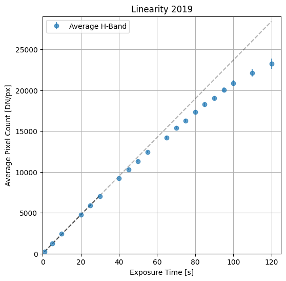
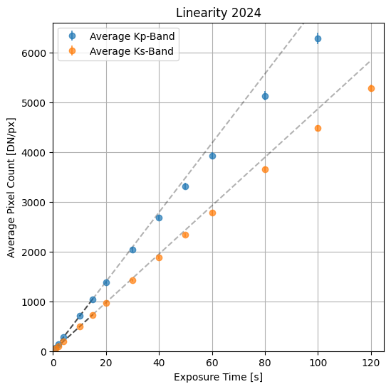
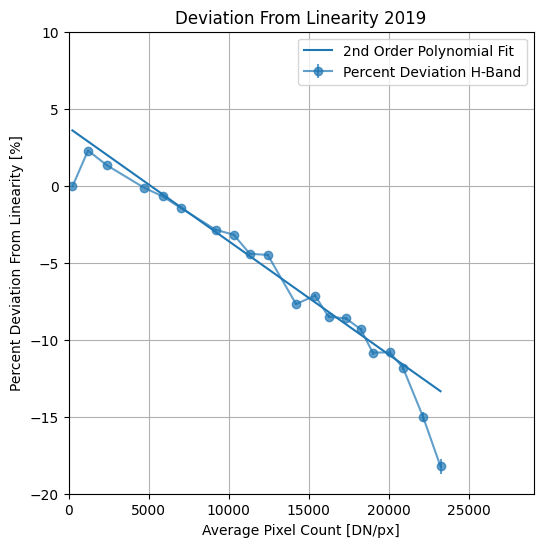
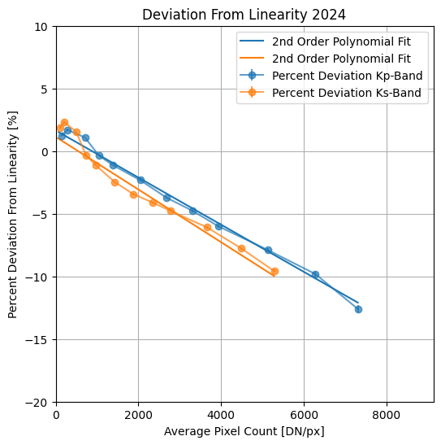
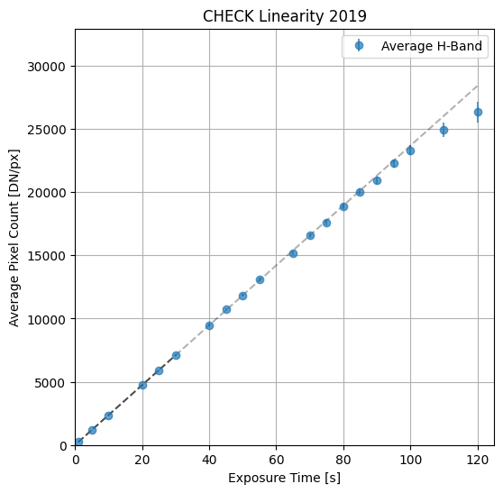
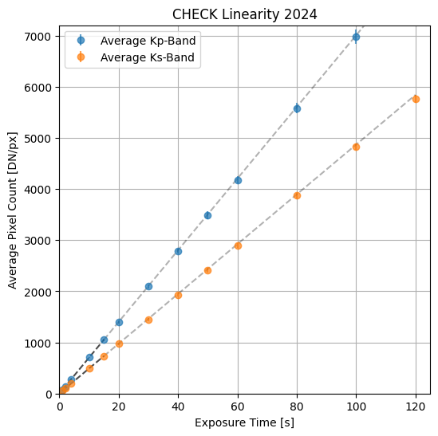

# NIRC2 Non-Linearity Correction

Upgrades to NIRC2 in late 2023 slightly changed the behavior of the detector, notably, the gains are different. Changing the gain has resultingly changed the linearity characteristics of the detector. We perform an analysis using reduced data from early 2024 with the new instrument upgrades and characterize the non-linearity in the system. A function to correct for the non-linearity is provided. However, recent changes (~July 2024) require that a linearity test be performed again and new data needs to be taken.

## Installation

``` bash
git clone https://www.github.com/jsnguyen/nirc2_nonlinearity_correction
pip install ./nirc2_nonlinearity_correction
```

## Usage

``` python
from nirc2_nonlinearity_correction import NIRC2

data = np.ones((1024,1024))
corrected = NIRC2.apply_nonlinearity_correction(data)
```

If you want to regenerate the correction curves, and diagnostic plots:

``` python
from nirc2_nonlinearity_correction import linearity

linearity('2024')
linearity('2019')

 # make the check plots
linearity('2024', use_correction_curve=True, save_curves=False)
linearity('2019', use_correction_curve=True, save_curves=False)
```

## Analysis

In 2024, linearity data was collected in Kp and Ks band. Data was collected simply by turning on the flat lamps and exposing for increasing amounts of time. While we don't expect any difference between wavelengths, slight variation is observed in the dataset. Both 2019 and 2024 datasets are included in this repository.

Plots showing the non-linearity:

<div>
    
    
</div>

Plots showing the percent deviation from linearity:

<div>
    
    
</div>

The correction curves were derived from polynomial fits to the percent deviation from linearity. Note that we cut off some points on each end of the curve to fit 100 to 20000 DN in 2019, 100 to 5000 DN in 2024 a little better. In practice, data values on images typically fall somewhere in this range.

Lastly, checking that our correction works:
<div>
    
    
</div>

And we see that the plots are now much closer to linear across the range! The upper ends aren't so important to fit since the detector typically does not reach those levels.
