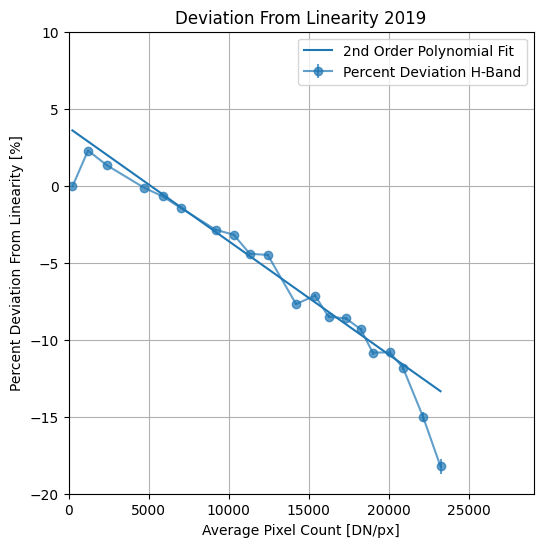
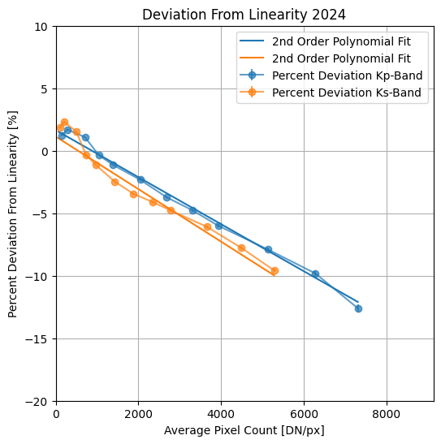

# NIRC2 Non-Linearity Correction

Upgrades to NIRC2 in late 2023 slightly changed the behavior of the detector, notably, the gains are different. Changing the gain has resultingly changed the linearity characteristics of the detector. We perform an analysis using reduced data from early 2024 with the new instrument upgrades and characterize the non-linearity in the system. A function to correct for the non-linearity is provided. However, recent changes (~July 2024) require that a linearity test be performed again.

In 2024, linearity data was collected in Kp and Ks band. While we don't expect any difference between wavelengths, slight variaiont is observed in the dataset.

Plots showing the non-linearity:

<div>
    
    
</div>

Plots showing the percent deviation from linearity:

<div>
    
    
</div>

The correction curves were derived from fits to the percent deviation from linearity.

## Installation

``` bash
git clone https://www.github.com/jsnguyen/nirc2_nonlinearity_correction
pip install ./nirc2_nonlinearity_correction
```

## Usage

``` python
from nirc2_nonlinearity_correction import NIRC2

data = np.ones((1024,1024))
corrected = NIRC2.apply_nonlinearity_correction(data)
```

If you want to regenerate the correction curves, and diagnostic plots:

``` python
from nirc2_nonlinearity_correction import linearity

linearity('2019')
linearity('2024')
```
