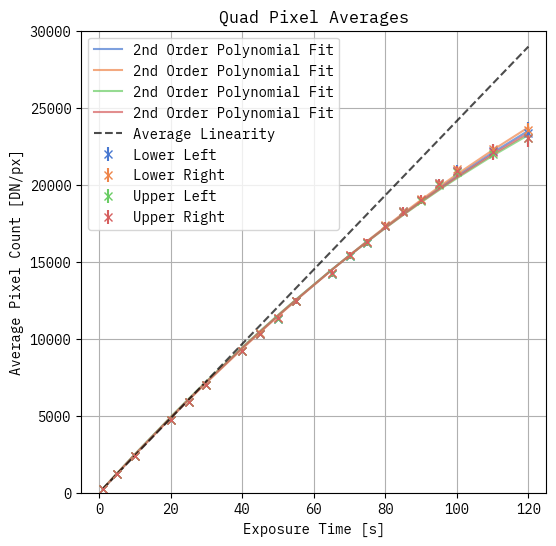
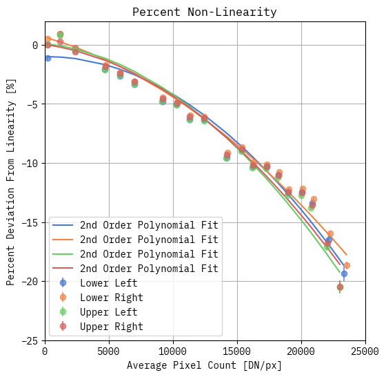

# NIRC2 Non-linearity Analysis





The code to correct the nonlinearity can be found in `src/nirc2_nonlinearity_correction/__init__.py`.

`quad_correct_nonlinearity` corrects each quadrant independently from a fit to each quadrant from the original data. This is probably more correct than using the same correction for each quadrant.

`correct_nonlinearity` corrects the entire frame with the same correction. This should be pretty close to the `quad_correct_nonlinearity`.

The coefficients from the fit were determined from the analysis in the jupyter notebook provided. See the jupyter notebook `analysis/nonlinearity_analysis.ipynb` for analysis details.

Building the Python wheel file:

```
pip install -r requirements.txt
python -m build
pip install --force-reinstall dist/nirc2_nonlinearity_correction-0.0.1-py3-none-any.whl
```

Usage:

```
from nirc2_nonlinearity_correction import NIRC2


data = np.ones((1024,1024))
corrected = NIRC2.correct_nonlinearity(data)
quad_corrected = NIRC2.quad_correct_nonlinearity(data)
```

